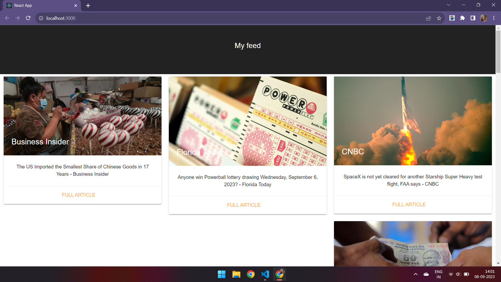
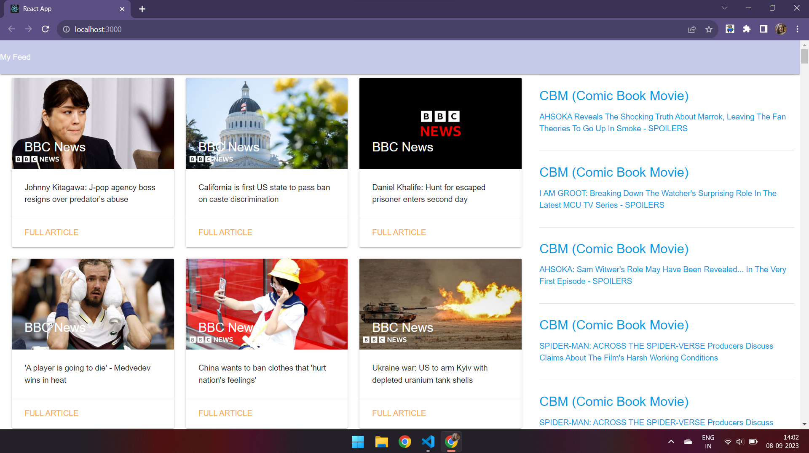

# React News App
This is a simple React-based news application that fetches and displays the latest business news headlines from the *News API*. Users can view a list of news articles and click on individual articles to read more about them. This project serves as a starting point for building React-based applications that fetch and display data from an external API.

## Project Folders Overview
As we know there are two well-known methods for interacting with API, 'fetch' and 'axios'

Folder 1: App1
In Folder 1, you will find "App1", a dynamic "News Feed client page" that retrieves data from an external API using the "fetch" method. This project provides a user-friendly interface for accessing the latest news articles.

Folder 2: App2
Folder 2 houses "App2", which shares the core functionality of App1. However, it goes a step further by incorporating an additional "side news section." In this section, data is retrieved from the API using the "axios" method, enhancing the user experience with even more news content.

Here's a brief overview of both methods:

1. Fetch Method:
Utilizes the built-in "fetch" function provided by modern web browsers.
Offers a straightforward way to make HTTP requests and handle responses.
Requires fewer dependencies, making it lightweight and efficient.
Well-suited for basic API interactions and simple data retrieval tasks.

2. Axios Method:
Axios is a popular JavaScript library for making HTTP requests.
Provides a more comprehensive feature set, including support for interceptors, request/response transformations, and error handling.
Offers better cross-browser compatibility and additional configuration options.
Ideal for complex API integrations, handling larger datasets, and implementing advanced features like automatic request retries.
Both methods have their strengths, and the choice between them depends on the specific requirements and complexity of your project.

## Getting Started
To clone and run this project on your local machine, follow these instructions:

1.Clone the Repository: git clone <repository-url>

2.Install Dependencies: 
->cd React_NewsApi_App1 / cd React_NewsApi_App2 (depending on project folder you choose)
->npm install

3.Set Up Environment Variables:
->Create a .env.local file in the root directory.
->Add your News API key to the .env.local file like this: REACT_APP_NEWS_API_KEY=YOUR_API_KEY_HERE (Replace YOUR_API_KEY_HERE with your actual News API key.)

4.Start the Development Server: npm start

5.Open in Your Browser: The React development server will start, and the application will be available at http://localhost:3000 in your web browser.

6.Explore the App: You can now explore the news app, view the latest business news headlines, and click on individual articles to read more about them.

## Contributing
If you'd like to contribute to this project, feel free to open an issue or submit a pull request. Any improvements or bug fixes are welcomed!

## License
This project is licensed under the MIT License - see the LICENSE file for details.

That's it! You now have the React News App up and running on your local machine. Enjoy exploring the latest business news!